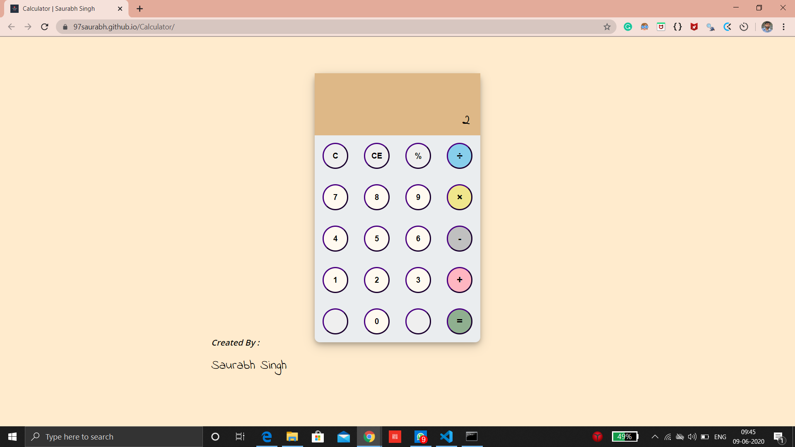

# Calculator

I have created a simple calculator using javaScript.
One can perform simple operations like addition, subtraction, division and multiplication.
Visit Here [Link](https://97saurabh.github.io/Calculator/)

